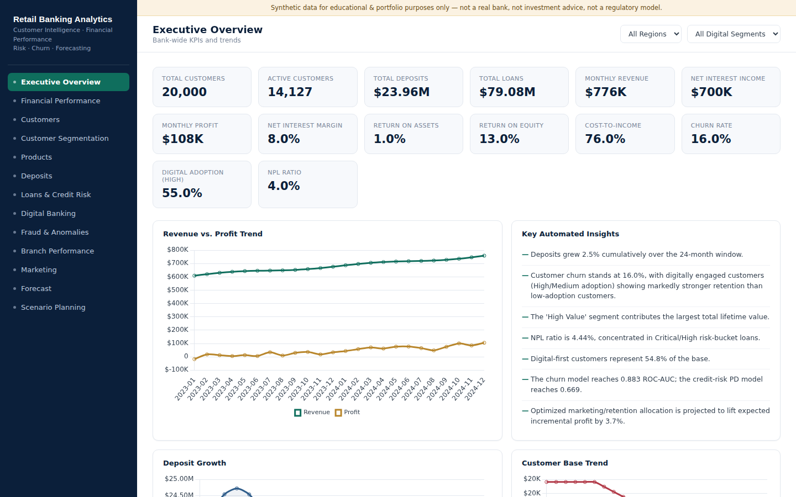
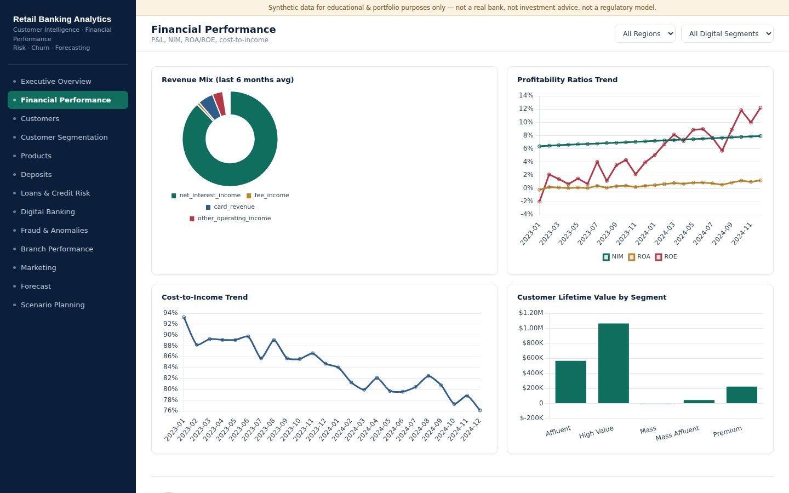
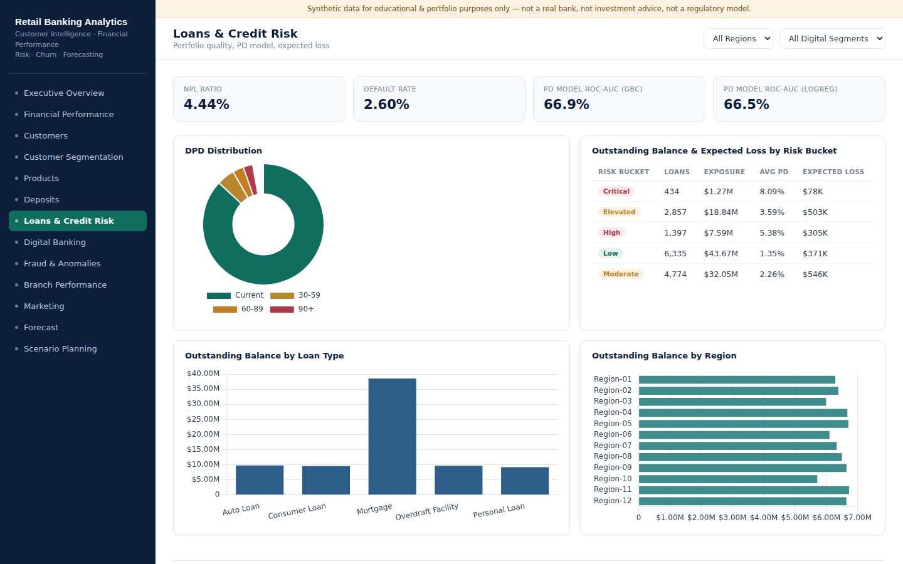
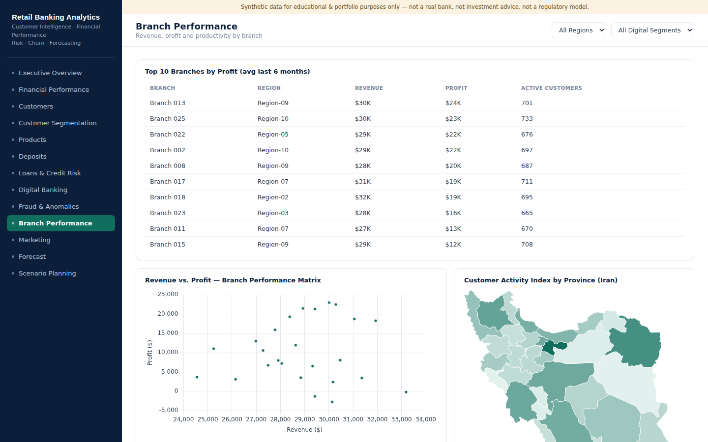
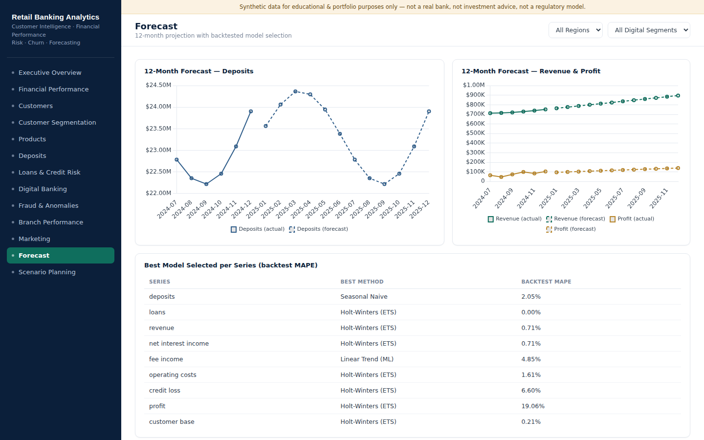
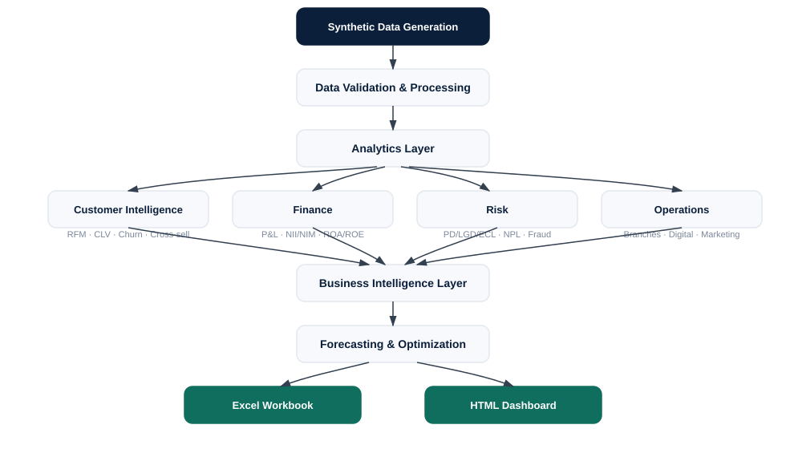

# Retail Banking Analytics

### Customer Intelligence, Financial Performance, Risk, Churn & Forecasting

> ⚠️ **All data in this repository is synthetic**, generated with fixed
> random seeds for reproducibility. It does not represent any real bank,
> customer, or transaction. This project is for educational and portfolio
> purposes only — it is not a regulatory banking model, investment
> recommendation, or credit decisioning system. See
> [`docs/assumptions.md`](docs/assumptions.md) for full details.

---

## Executive Summary

This project builds a complete, end-to-end retail banking analytics case
study — from synthetic data generation, through customer segmentation,
churn and credit-risk machine learning models, financial modeling,
12-month forecasting, scenario planning, and marketing-budget optimization,
to an interactive executive dashboard and a board-ready Excel workbook.

It answers one central management question:

> **"How should the bank grow the customer base and loan portfolio while
> maintaining healthy profitability and controlling credit risk?"**

## Preview


*Executive Overview — bank-wide KPIs, revenue/profit trend, and automated insights.*


*Financial Performance — revenue mix, profitability ratio trends, and CLV by segment.*


*Loans & Credit Risk — DPD distribution, PD model performance, expected loss by risk bucket.*


*Branch Performance — top branches by profit, revenue/profit matrix, and a real Iran province choropleth map.*


*Forecast — 12-month projections with per-series model selection via backtest MAPE.*

**Full preview of all 13 sections:** [`docs/dashboard_preview.md`](docs/dashboard_preview.md)

**[Open the live dashboard](https://Milad-Shabani.github.io/Retail-banking-analytics/)**
(after GitHub Pages is enabled — see [Publishing](#publishing-to-github)) or
open `outputs/dashboard/dashboard.html` directly in any browser — it is a
single, self-contained file with no server or database required.

## Business Problem

See [`docs/business_case.md`](docs/business_case.md) for the full list of
15 business questions this project answers (customer value, churn risk,
product performance, deposit/loan trends, cross-sell opportunity, branch
performance, budget allocation, and 12-month forecasts).

## Data Model

22 interlinked tables covering customers, accounts, transactions, cards,
loans & loan payments, deposits, products & product ownership, branches &
employees, channels, monthly customer/account/product/branch metrics,
customer interactions, campaigns & responses, fraud events, credit events,
bank-level financials, and forecast/scenario inputs. Full column-level
detail: [`docs/data_dictionary.md`](docs/data_dictionary.md).

| | |
|---|---|
| Customers | 20,000 |
| Observation window | 24 months |
| Accounts | ~31,000 |
| Transactions | ~500,000 |
| Loans | ~15,800 |
| Cards | ~11,400 |
| Term deposits | ~3,200 |
| Branches | 25 across 12 regions |
| Products | 12 |

**Why this scale?** Deliberately scaled down from a production-size
dataset (500K+ customers / 5M+ transactions) for a fast-to-regenerate,
reasonably-sized public GitHub repository. Table structure, business logic,
and statistical correlations mirror a full-scale build — see
[`docs/assumptions.md`](docs/assumptions.md).

## Architecture



```
Synthetic Data → Validation & Processing → Analytics Layer
   (Customer Intelligence · Finance · Risk · Operations)
        → Business Intelligence → Forecasting & Optimization
        → Excel Workbook + HTML Dashboard → Management Insights
```

## Customer Segmentation

Six complementary schemes computed directly from simulated behavior (not
random assignment): **RFM**, **Value** (Mass → Premium), **Lifecycle** (New
→ Churned), **Behavioral** (Digital First, Branch Dependent, etc.),
**Digital Adoption**, and **Customer Lifetime Value**. Methodology:
[`docs/segmentation_methodology.md`](docs/segmentation_methodology.md).

## Financial Analytics

A fully reconciled monthly P&L (NII → Revenue → Operating Cost → Credit
Loss → Profit), a simplified balance sheet, and NIM/ROA/ROE/Cost-to-Income
ratio tracking. Latest month: **$774K revenue**, **$104K profit**, **8.2%
NIM**, **1.2% ROA**, **12.2% ROE**, **77% cost-to-income**. Every P&L line
is checked for internal consistency in the test suite. Methodology &
disclosed simplifications: [`docs/financial_model.md`](docs/financial_model.md).

## Credit Risk

PD/LGD/EAD/Expected-Credit-Loss framework at the loan level, with a
Gradient Boosting vs. Logistic Regression PD model (**ROC-AUC 0.665 /
0.696**, ~2.5% base default rate — a deliberately hard, realistic
imbalanced-classification problem). NPL ratio: **4.4%**. Methodology:
[`docs/risk_methodology.md`](docs/risk_methodology.md).

## Customer Churn

Gradient Boosting churn model trained on behavior observed through month 18
only (temporal cutoff, no leakage), predicting churn by month 24:
**ROC-AUC 0.883**. See [`docs/risk_methodology.md`](docs/risk_methodology.md).

## Cross-Sell & Next-Best-Product

Market-basket-style product-affinity (lift) analysis, a realized
retention comparison for multi-product vs. single-product customers, and a
Random Forest next-best-product propensity model per candidate product.

## Forecasting

Four candidate methods (Seasonal Naive, Moving Average, Holt-Winters ETS,
Linear Trend ML) are backtested per KPI on a 6-month holdout; the
lowest-MAPE method is selected for the final 12-month forecast — audited
in `outputs/reports/forecast_results.json`. Methodology:
[`docs/forecasting_methodology.md`](docs/forecasting_methodology.md).

## Scenario Planning

Base / Growth / Efficiency / Downside / Stress cases project deposits,
loans, revenue, credit loss and profit 12 months forward under different
macro/strategic assumptions — explored interactively on the dashboard.

## Optimization

A linear program (PuLP/CBC) allocates a $500K annual marketing/retention
budget across five customer value segments to maximize expected
incremental profit, subject to budget, per-segment ceiling/floor, and
at-risk-segment retention constraints. Optimized allocation lifts expected
profit **+3.7%** over an even split. Methodology:
[`docs/optimization_methodology.md`](docs/optimization_methodology.md).

## Dashboard

A single self-contained HTML file (`outputs/dashboard/dashboard.html`,
also published to `docs/index.html` for GitHub Pages) — white background,
clean executive styling, Chart.js (inlined, no external CDN dependency at
runtime). Thirteen sections: Executive Overview, Financial Performance,
Customers, Customer Segmentation, Products, Deposits, Loans & Credit Risk,
Digital Banking, Fraud & Anomalies, Branch Performance, Marketing,
Forecast, and Scenario Planning — each with KPI cards, charts, and data
tables. Region and Digital-Adoption filters drill into the relevant
precomputed breakdowns. The Branch Performance section also includes a real
choropleth map of Iran's 31 provinces (geometry simplified from
OpenStreetMap contributors, ODbL) shaded by an illustrative, self-generated
customer-activity index (a standalone visualization, not derived from the
core dataset's generic region labels).

## Excel Workbook

`outputs/excel/RETAIL_BANKING_ANALYTICS.xlsx` — 23 sheets (Executive
Summary, Financials, Balance Sheet, NII/NIM, Customers, Customer Segments,
RFM, Cohorts, CLV, Products, Deposits, Loans, Credit Risk, Fraud, Branches,
Digital Banking, Marketing, Forecast, Scenarios, Optimization, KPI
Definitions, Data Dictionary, Assumptions), with embedded charts, freeze
panes, and formatted currency/percentage cells. Validated with 0 formula
errors.

## Key Business Findings

- Digital-first customers show materially higher transaction frequency and
  lifetime value, and lower churn, than branch-dependent customers.
- Credit risk is concentrated in a small number of high-risk-bucket loans:
  the "Critical" and "High" buckets hold a disproportionate share of
  expected credit loss relative to their loan count.
- Several product pairs (e.g., Credit Card + Overdraft Facility, Savings +
  Mortgage) show meaningfully higher realized retention than the
  first product alone — a concrete cross-sell prioritization signal.
- Optimized marketing/retention budget allocation shifts spend toward
  Premium and High Value segments (within the retention floor for
  Mass/Mass Affluent), for a **+3.7%** expected profit lift over an even
  split at the same total budget.
- The Efficiency Case scenario (moderate growth, disciplined cost control)
  produces the highest 12-month cumulative profit of the five scenarios —
  ahead of the higher-growth-but-higher-cost Growth Case.

## Project Structure

```
retail-banking-analytics/
├── README.md · LICENSE · requirements.txt · pyproject.toml · .gitignore
├── .github/workflows/quality.yml       CI: regenerate data, run pipeline, test, build
├── assets/                              architecture diagram, dashboard previews, author photo
├── data/raw/ , data/processed/          generated CSVs + model outputs
├── src/
│   ├── data_generation/generate_all.py  synthetic data generator (single source of truth)
│   ├── customer/                        churn model, cross-sell/NBP analytics
│   ├── risk/                            credit-risk PD model
│   ├── forecasting/                     12-month forecast, scenario planning
│   ├── optimization/                    budget allocation (PuLP)
│   ├── reporting/build_excel.py         Excel workbook builder
│   └── dashboard/                       dashboard data prep + HTML/JS assembly
├── scripts/                              thin wrappers used by CI (generate_data, run_pipeline, build_excel, build_dashboard)
├── outputs/{dashboard,excel,reports}     build artifacts (dashboard.html, .xlsx, model JSON)
├── docs/                                 business case, data dictionary, methodology, assumptions
├── tests/                                58 pytest tests (data quality, financial reconciliation, models, forecasting, optimization, segmentation)
├── github_release/publish.sh|.bat        one-command GitHub publish + Pages setup
└── notebooks/                            (reserved for exploratory analysis)
```

## How to Run

```bash
pip install -r requirements.txt

python scripts/generate_data.py     # generates all 22 tables into data/raw/
python scripts/run_pipeline.py      # churn model, credit risk model, cross-sell,
                                     # forecasting, scenarios, optimization
python scripts/build_excel.py       # outputs/excel/RETAIL_BANKING_ANALYTICS.xlsx
python scripts/build_dashboard.py   # outputs/dashboard/dashboard.html + docs/index.html

pytest tests/ -v                    # 58 tests
```

Total run time: ~1–2 minutes end-to-end on a laptop.

## Testing & Data Quality

58 tests across data quality (schema, duplicates, referential integrity),
financial reconciliation (every P&L line checked to reconcile to its
components), model performance bounds (churn/credit ROC-AUC, NPL ratio,
default rate), forecasting (12-month coverage, valid method selection),
scenario planning (stress case worse than base case, as it should be), and
optimization (budget/ceiling/floor constraints respected). Run with
`pytest tests/ -v`.

## Publishing to GitHub

**Windows:**
```
publish.bat
```

**macOS/Linux:**
```bash
bash github_release/publish.sh
```

Requires `git` and the [GitHub CLI](https://cli.github.com/) (`gh auth
login` first). This creates the public repo, pushes the code, sets topics,
and enables GitHub Pages serving `docs/index.html` (the dashboard).

## Tech Stack

Python · Pandas · NumPy · Scikit-learn · Statsmodels · PuLP · OpenPyXL ·
Pytest · HTML/CSS/JavaScript · Chart.js

## Limitations

See [`docs/assumptions.md`](docs/assumptions.md) for the full list —
in short: synthetic data at reduced scale; simplified (non-regulatory)
financial and credit-risk ratios; a short 24-month history for
backtesting; and a stylized (not calibrated) marketing-response model for
optimization.

## Author

**Built by Milad Shabani**
Business Intelligence · Data Analytics · Data Engineering
GitHub: [Milad-Shabani](https://github.com/Milad-Shabani)
