# Dashboard Preview — All Sections

Full-page screenshots of every section of `outputs/dashboard/dashboard.html`
(also published at `docs/index.html` for GitHub Pages). All numbers come
from the synthetic dataset described in [`data_dictionary.md`](data_dictionary.md);
see [`assumptions.md`](assumptions.md) for what they do and don't represent.

## 1. Executive Overview
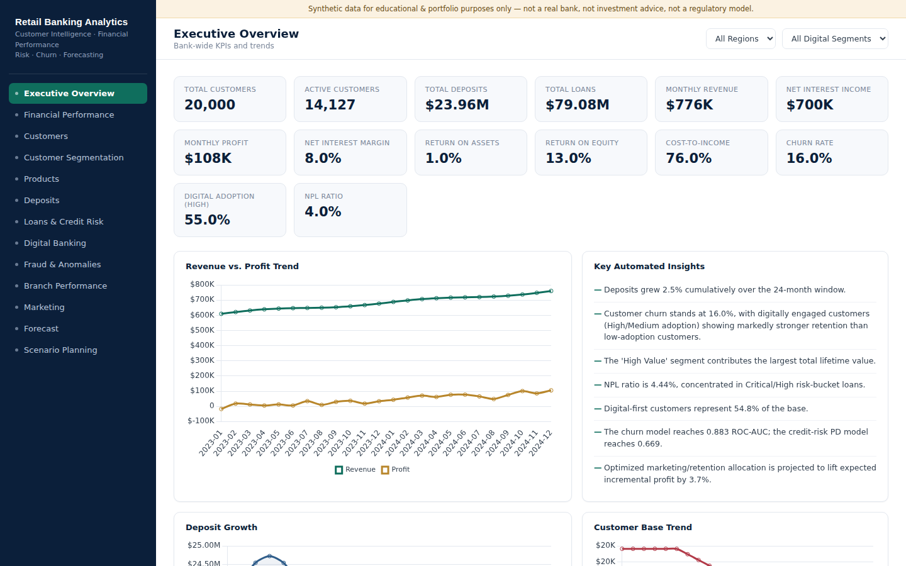

## 2. Financial Performance
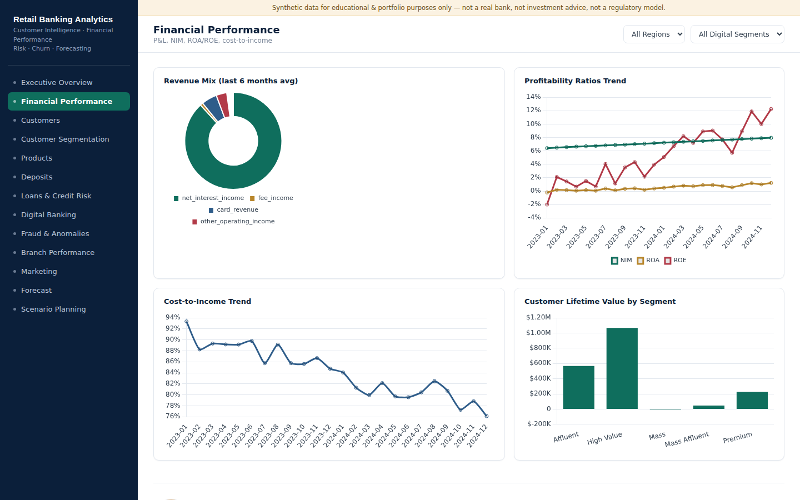

## 3. Customers
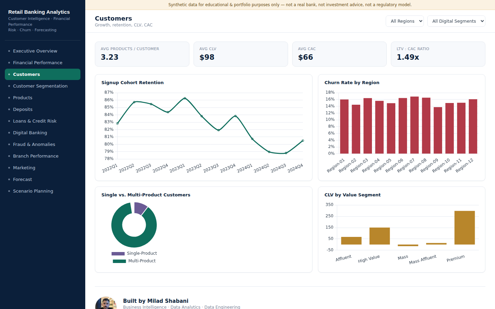

## 4. Customer Segmentation
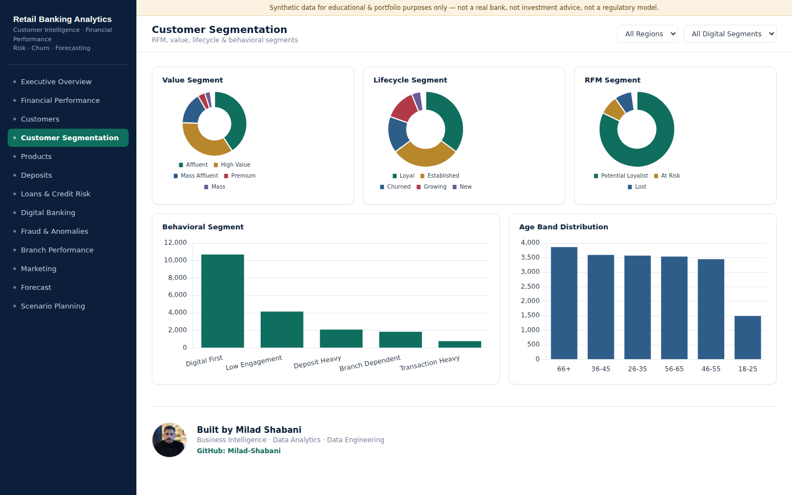

## 5. Products
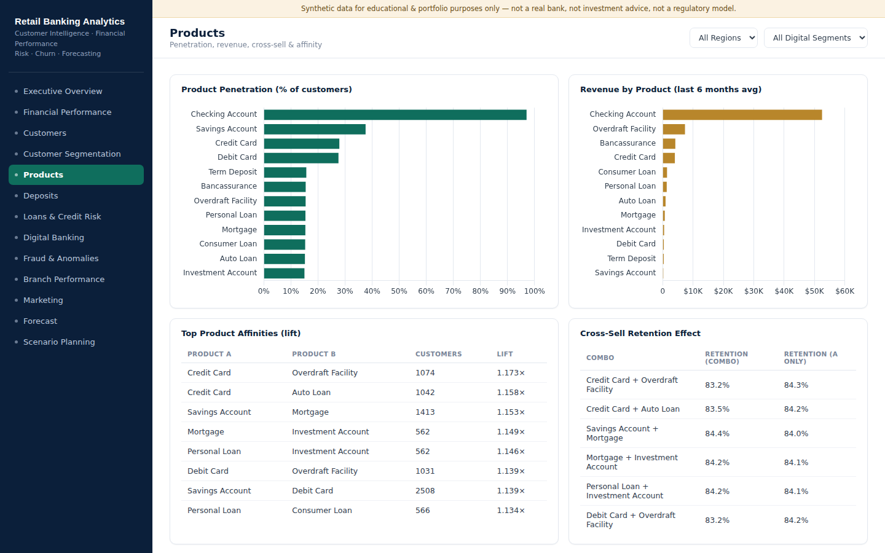

## 6. Deposits
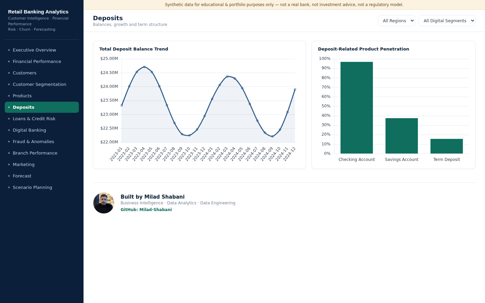

## 7. Loans & Credit Risk
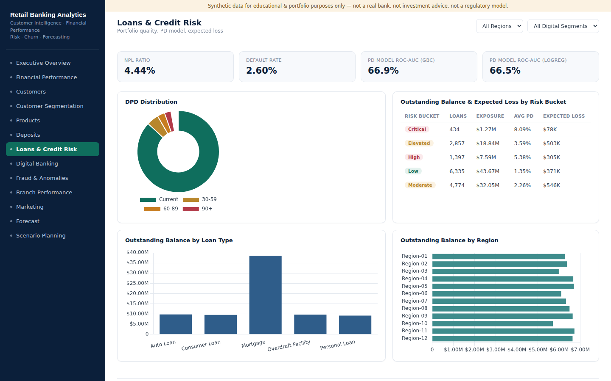

## 8. Digital Banking
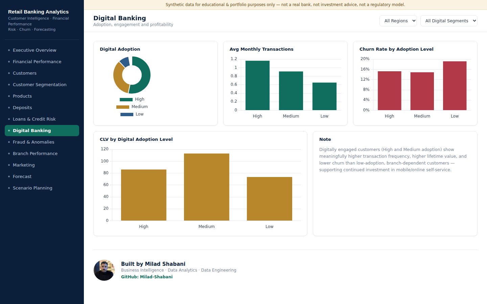

## 9. Fraud & Anomalies
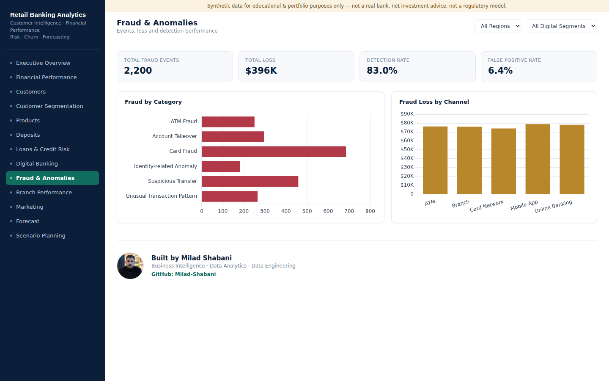

## 10. Branch Performance

## 11. Marketing
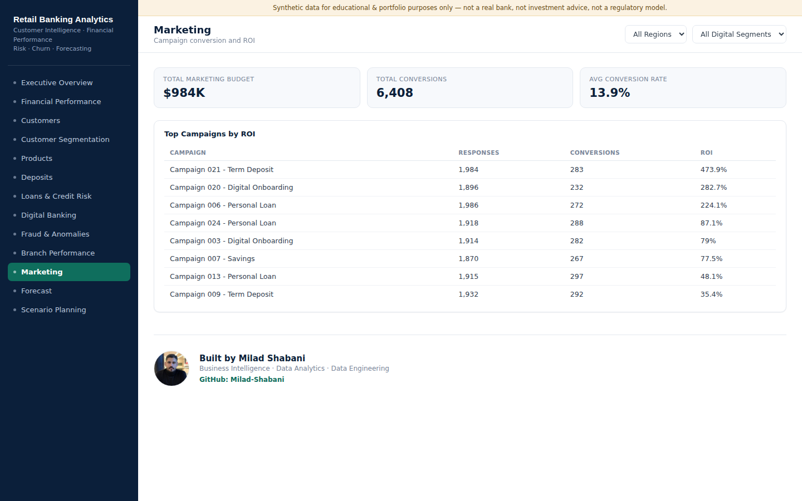

## 12. Forecast
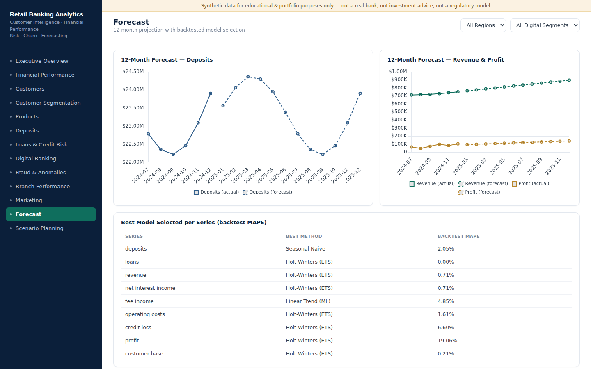

## 13. Scenario Planning
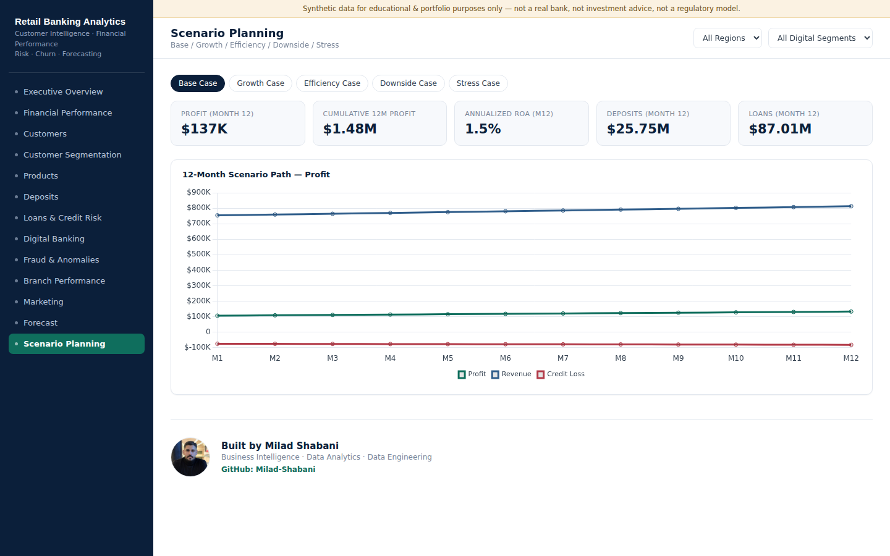
